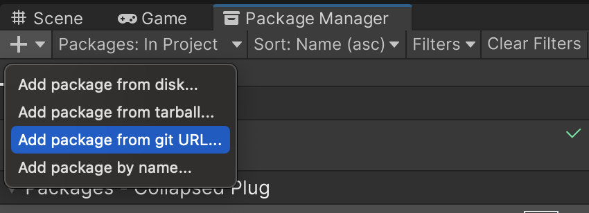
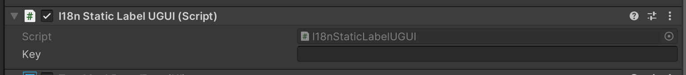
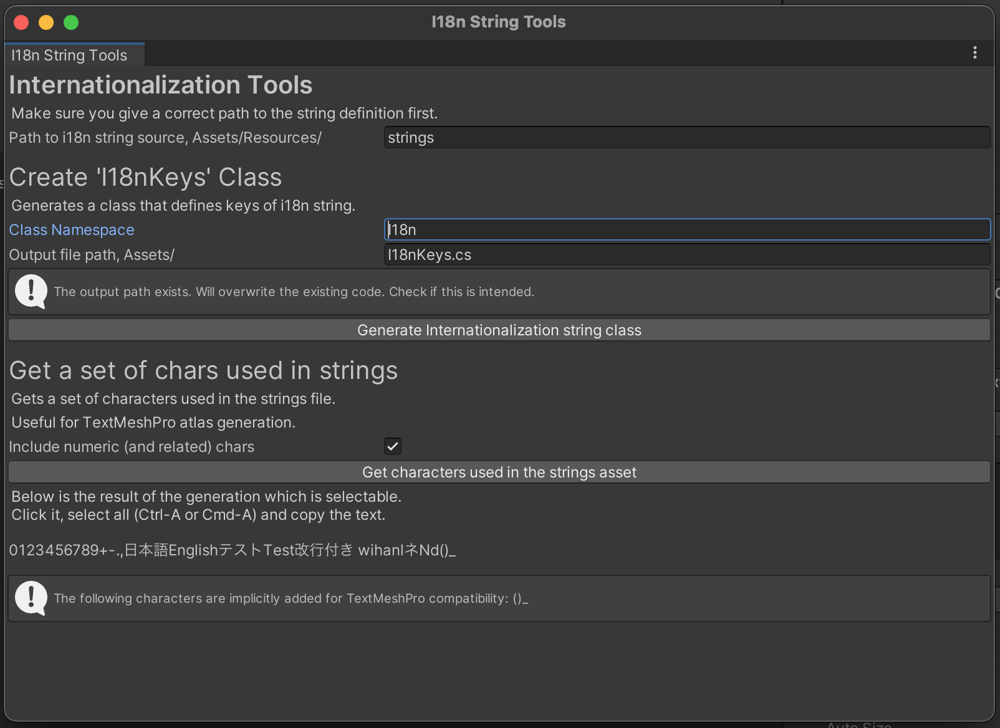
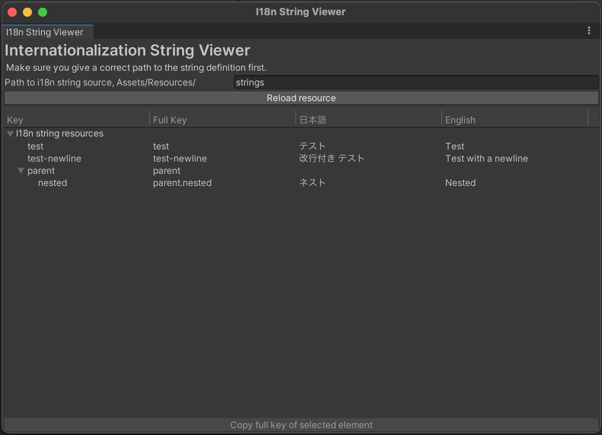

# ClpsPLUG's Internationalization Tools for Unity

This package enables internationalization of strings in Unity.

Currently supports Japanese and English.

## Installation

Use UPM - select "Add package from Git URL" and paste the following:

```
https://github.com/Clpsplug/I18nTools.git
```



## How to use

> **Table of contents**
> 1. [Define the supported languages](#toc1)
> 2. [Define the "strings"](#toc2)
> 3. [Use the strings - the basic way](#toc3)
> 4. [Use the strings - the **easy** way!](#toc4)
> 5. [Change language](#toc5)

### 1. Define the supported languages
<a id="toc1"></a>

This plugin looks for a JSON file at the following path:

`Assets/Resources/I18n/SupportedLanguages.json`

And the content of the file should look like this:

```json5
{
  // NOTE: This example uses JSON5, but **an actual JSON CANNOT CONTAIN COMMENTS!**
  // Start with the "langs" key
  "langs": [
    {
      "id": 0, // ID to refer to this language
      "code": "ja", // Code to be used in the string definition
      "display": "日本語" // User-friendly text
    },
    {
      "id": 1,
      "code": "en",
      "display": "English"
    }
  ]
}
```

The `code` value will be used as a key determine which string is for which language.
It can be those ISO 639-1 style codes like above, or you can even use locale codes like `ja_JP`.

You may add as many languages as you want - just make sure the `id` and `code` key do not collide.

### 2. Define the "strings"
<a id="toc2"></a>

The i18n strings are provided through the following path by default:

```
Assets/Resources/strings.json
```

the strings are defined in the following JSON format:

```json5
// NOTE: This example uses JSON5, but **an actual JSON CANNOT CONTAIN COMMENTS!**
// The root element is always an array.
[
  // A regular string. Regular strings always have 'key', and codes from the supported languages definition as the keys.
  {
    "key": "test",
    "ja": "テスト", // Japanese text, note that we use `ja` as key as we specified in the previous section.
    "en": "Test" // English text
  },
  {
    // Using "_long" variant enables you to write long text without having to add newlines.
    "key": "test-newline",
    "ja_long": [
      "改行付き",
      // Elements are joined by a newline (\n).
      "テスト"
    ],
    "en_long": [
      "Test with",
      "a newline"
    ],
    // Optional - set true to join string elements w/o newlines.
    "exclude_newline": false
  },
  // You can also nest the strings to organize them better!
  {
    "key": "parent",
    // Child strings are given with "strings" key, which takes an array.
    "strings": [
      {
        "key": "nested",
        "ja": "ネスト",
        "en": "Nested"
      }
      // Of course, we can nest another resources.
    ]
  }
]
```

### 3. Use the strings - the basic way
<a id="toc3"></a>

There are two ways to use the string - from the code, or as a static label in the scene.

#### From the Code

Use this syntax to get the string.

```csharp
using Clpsplug.I18n.Runtime;

string i18nString = I18nString.For("key");

```

The `"key"` is replaced with the one given by your JSON string definition.
For example, if you want to show `Test`, you would write:

```csharp
I18nString.For("test"); // returns "Test"
```

To reach nested string elements, concatenate the keys with periods(`.`).

```csharp
I18nString.For("parent.nested"); // returns "Nested"
```

#### As a static label

You want to grab either the `I18nStaticLabel` component or the `I18nStaticLabelUGUI` component
depending on which one you are using.

* If you are placing the label in the world space, use `I18nStaticLabel`,
as the GameObject in question shoudl have the `TextMeshPro` component.  
* If you are placing the label as a UI element, pick `I18nStaticLabelUGUI`,
as the GameObject in question should have the `TextMeshPro (UI)` component.

The component accepts 'key' as its parameter. 
Specify the key from your JSON string definition and the string of matching language will be set to
the corresponding TextMeshPro component.



### 4. Use the strings - the **easy** way!

<a id="toc4"></a>

Specifying keys is tedious. That's why we have editor tools!

We have two editor tools included:

* I18n String Viewer
* I18n Tools Window

both of which will be of great use.

To launch these, notice that your Unity Editor now has 'Tools > ClpsPLUG' menu item - 
inside the 'I18n' menu, you will find those tools.

#### The Tools Window

The tools window will be of big use when using the strings from your code.



This tool can perform two tasks: generate `I18nKeys` class and get characters used in your string resources.

First, complete the path in the textbox so that it points to your string resource.

Then specify the output file path (end it with `.cs`), provide optional class namespace,
and click **Generate internationalization string class.**.

This will generate a file at the specified location that contains something like this:

```csharp
// Auto-generated by I18n Class Generator.
// Any changes will be lost.
// ReSharper disable InconsistentNaming
// ReSharper disable UnusedMember.Global

namespace I18n
{
    /// <summary>
    /// Members in this class can be supplied into <see cref="ExplodingCable.I18n.Runtime.LocalizedString.For"/> parameter.
    /// </summary>
    public static class I18nKeys
    {
        /// <summary>
        /// ja: テスト<br/>
        /// en: Test<br/>
        /// </summary>
        public const string test = "test";
        /// <summary>
        /// ja: 改行付き テスト<br/>
        /// en: Test with a newline<br/>
        /// </summary>
        public const string test_newline = "test-newline";
        public static class Parent
        {
            /// <summary>
            /// ja: ネスト<br/>
            /// en: Nested<br/>
            /// </summary>
            public const string nested = "parent.nested";
        }

    }
}

```

These static classes and members can be directly supplied into the `I18nString.For()` method,
greatly reducing the risk of typo.

```csharp
// instead of writing this...
I18nString.For("parent.nested"); // returns "Nested"

// write THIS!
using I18n;
I18nString.For(I18nKeys.Parent.nested); // also returns "Nested"
```

The second button, **Get characters used in the strings asset**, 
is most useful for TextMeshPro's Font Asset creator.  
Since languages such as Japanese have extremely wide range of possible characters to appear,
containing them all would be a bad idea as it bloats your final game size.

When you click this button, the tool will scan for characters used in your string resource,
and packs them as a string, which appears below.  
This string can then be clicked and "Select All" (Cmd-A, Ctrl-A) and "Copy" (Cmd-C, Ctrl-C)
and pasted directly into the font asset creator.

> [!NOTE]  
> A few characters will be implicitly added to avoid TextMeshPro warnings.  
> You can also check "Include numeric (and related) chars" to include such chars
> without having to manually specify them in your string resource.

#### The String Viewer

This string viewer lets you see the string resource in a tree view!



First, complete the path in the textbox so that it points to your string resource.

Select a row from the list and click **Copy full key of selected element** 
to copy the "full key" of the string to the clipboard.
This value then can be used to paste into 
the `I18nStaticLabel` component or the `I18nStaticLabelUGUI` component.


### 5. Change language
<a id="toc5"></a>

To change the language, we need to use the `id` value from the supported languages definition (see [Section 1.](#toc1)).

Once you have implemented the language selection screen, those are the methods you want to run.

```csharp
using Clpsplug.I18n.Runtime;

    int lang = 0 /* language choice */
    
    I18nStringRepository.GetInstance().ChangeLanguage(lang);
    I18nTool.NotifyLanguageSwitchToStaticLabels();
```

The first method, `ChangeLanguage(lang)`, changes the strings returned from `I18nString.For`
to the specified language.  
The second method, `I18nTool.NotifyLanguageSwitchToStaticLabels()`, triggers a refresh for 
all the GameObjects with either the `I18nStaticLabel` component or the `I18nStaticLabelUGUI` component attached
so that their text turns into the string of the specified language.

# TODO

* More documentation
